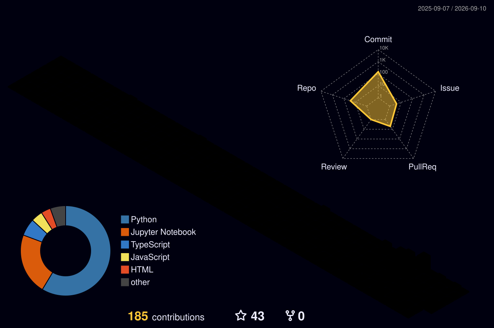

<div align="center">
    
<a href="https://regional-marmot.super.site/">

</a>


<br>

<a href="ayush-rao.notion.sie">

</a>

<a href="mailto:ayushtiwaridsai@gmail.com">

</a>


<a href="https://www.kaggle.com/ayushtiwariiitg">

</a>

<br><br>


</div>


# 📈 3D Contribution Graph

<p align="center">
  
</p>
# 🚀 About Me

```python
class AyushTiwari:

    def __init__(self):

        self.role = "Machine Learning Engineer"

        self.interests = [
            "Machine Learning",
            "Deep Learning",
            "Generative AI",
            "Large Language Models",
            "MLOps",
            "Computer Vision"
        ]

        self.currently_learning = [
            "Agentic AI",
            "Distributed Machine Learning",
            "Production ML Systems",
            "Advanced LLM Architectures"
        ]

        self.motto = "Build. Learn. Improve. Repeat."

    def mission(self):
        return "Transforming ideas into intelligent systems"
```


# ⚡ System Status

```text
╭──────────────────────────────────────────────╮
│ Name      : Ayush Tiwari                     │
│ Role      : Machine Learning Engineer        │
│ Focus     : Generative AI                    │
│ Status    : Building & Learning              │
│ Runtime   : Continuous Improvement           │
│ Version   : v2.0                             │
╰──────────────────────────────────────────────╯
```


# 🧠 Mission

Building AI systems that don't just predict —

they reason, remember, collaborate, and evolve.

### Current Areas of Interest

- Agentic AI
- Large Language Models
- Deep Learning
- Distributed Machine Learning
- Real-Time AI Systems
- MLOps & Production AI


# 🔭 What I'm Working On

- Building AI-powered applications and autonomous agents
- Developing production-grade Machine Learning systems
- Exploring LLMs and Generative AI workflows
- Contributing to open-source AI projects
- Creating scalable AI solutions for real-world problems


# 💼 Featured Projects

## Aura(in development)

Personal AI Digital Twin capable of memory, reasoning, contextual assistance, and personalized interactions.

**Tech Stack:** Python • FastAPI • LLMs • Vector Databases


## CivicPulse AI

AI-powered civic intelligence platform for extracting actionable insights from public data.

**Tech Stack:** Python • NLP • Machine Learning


## Open Source Intelligence Platform

Automated intelligence gathering and analysis framework powered by modern AI pipelines.

**Tech Stack:** Python • Data Pipelines • LLMs


## Leet Heat

Developer analytics platform for tracking coding performance and growth.

**Tech Stack:** React • FastAPI • PostgreSQL


# 🛠️ Tech Stack

## Languages


## AI & Machine Learning


## Data Science


## Backend & Infrastructure


# 📊 GitHub Analytics


<p align="center">
  
</p>

<p align="center">

</p>


# 📈 Contribution Graph

<p align="center">

</p>


# 🎯 Current Goals

- Build production-grade AI systems
- Master LLM Engineering
- Contribute to impactful open-source projects
- Publish high-quality AI/ML projects
- Participate in Kaggle competitions
- Secure top AI/ML engineering opportunities


# 🐍 Contribution Snake

<p align="center">

</p>


# 🤝 Connect With Me

📧 **Email:** ayushtiwaridsai@gmail.com

🌐 **Portfolio:** https://regional-marmot.super.site/

💼 **LinkedIn:** https://linkedin.com/in/ayus-tiwari

🐙 **GitHub:** https://github.com/Ayushdevo

📊 **Kaggle:** https://www.kaggle.com/ayushtiwariiitg


<div align="center">

### 💡 "The best way to predict the future is to build it."

</div>

